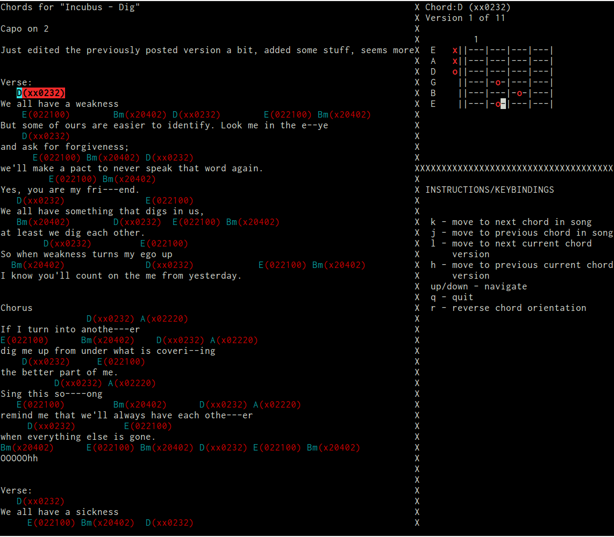

chorddb
=======

[](https://travis-ci.org/pignacio/chorddb)
[](https://coveralls.io/r/pignacio/chorddb?branch=master)

A guitar tablature parser



##Usage

```
chorddb parse <filename>           # Terminal mode
chorddb parse <filename> --curses  # Curses mode
```

###Additional options

```
-i/--instrument: choose instrument to parse tabs for. Should be one of
                 guitar, loog, ukelele
-t/--transpose: transpose the tablature the given number of steps
-c/--capo: simulates a capo on the instrument
```

